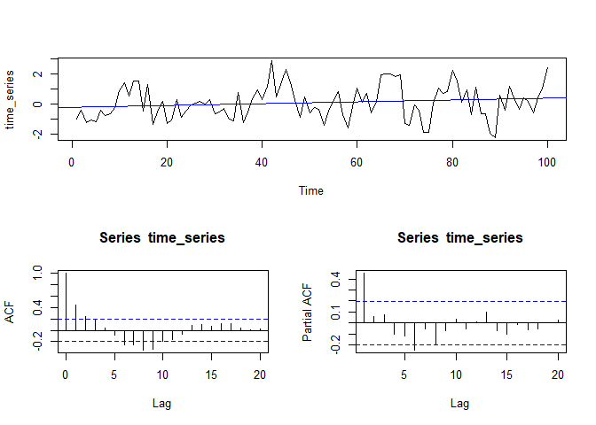
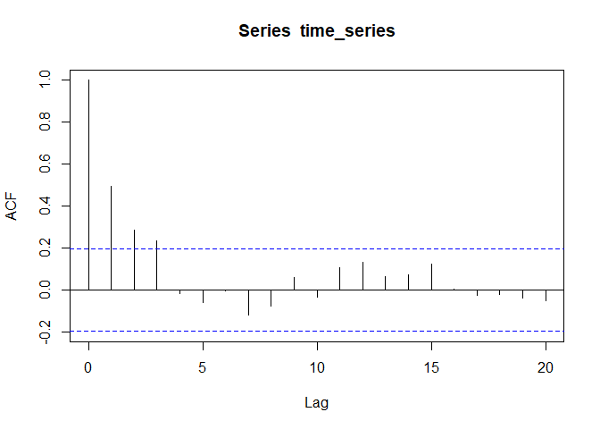
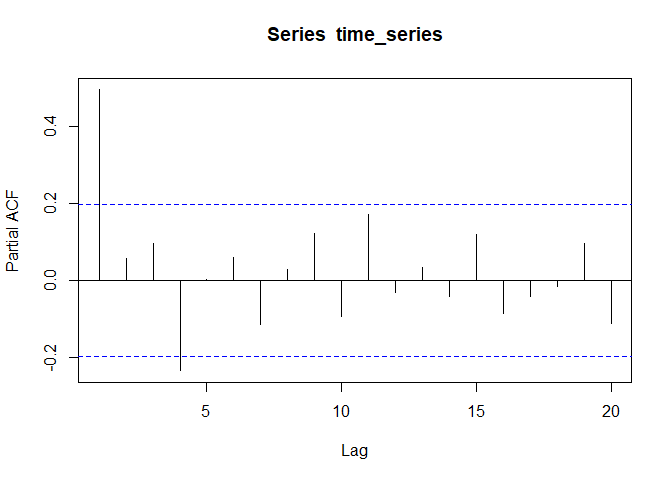
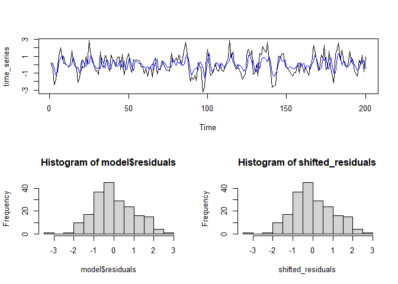
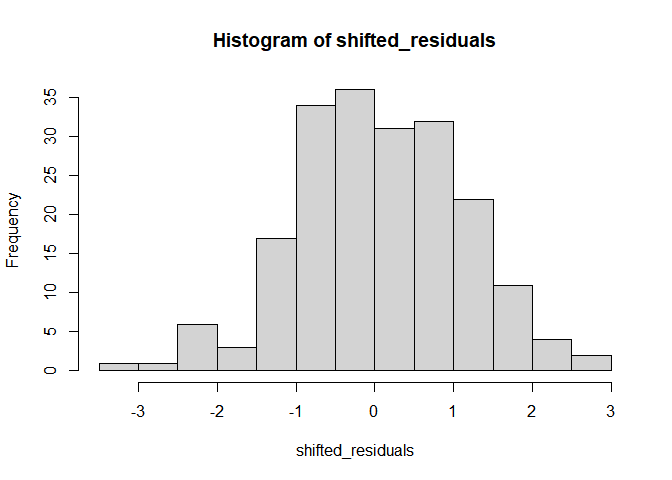

Inadequacy of t-tests for time series data
================
Nayef Ahmad
2022-03-04

-   [1 Overview](#overview)
-   [2 Libraries](#libraries)
-   [3 Single t-test](#single-t-test)
-   [4 Simulation of a large number of
    t-tests](#simulation-of-a-large-number-of-t-tests)
-   [5 Comparison using normally distributed
    data](#comparison-using-normally-distributed-data)
-   [6 Working with residuals from fitted ARIMA
    model](#working-with-residuals-from-fitted-arima-model)
    -   [6.1 Simulation over many
        iterations](#simulation-over-many-iterations)

# 1 Overview

It’s commonly known that violation of the independence assumption is a
problem for the t-test. One common specific way in which this violation
can occur is when there is dependence across time/sequence for a set of
data. Here we show that this can lead to serious inflation of the Type 1
error rate.

-   todo: show that the Type 1 error inflation is worse when the AR
    coefficient is higher.

Reference:

-   [Speegle & Clair, Section
    8.5.4](https://mathstat.slu.edu/~speegle/_book/HTCI.html)

# 2 Libraries

``` r
library(forecast)
```

    ## Warning: package 'forecast' was built under R version 4.0.5

    ## Registered S3 method overwritten by 'quantmod':
    ##   method            from
    ##   as.zoo.data.frame zoo

# 3 Single t-test

``` r
time_series <- arima.sim(model = list(ar = .5), n = 100)
plot(time_series)
fit <- lm(as.vector(time_series) ~ c(1:length(time_series)))
abline(fit, col = "blue")
```

<!-- -->

``` r
acf(time_series)
```

<!-- -->

``` r
pacf(time_series)
```

<!-- -->

``` r
sample_mean <- mean(time_series)
```

Here we have an `AR(1)` model with no “intercept” or starting term. By
definition, it is weakly stationary, with mean equal to zero. That is,
*μ* = 0.

The sample mean here is -0.0184821.

We can do a t-test to assess the null hypothesis
*H*<sub>0</sub> : *μ* = 0 vs alternative hypothesis
*H*<sub>*a*</sub> : *μ*! = 0. In this case, we know that in reality
*μ* = 0.

``` r
t_test_p_value <- t.test(time_series, mu=0)$p.value
alpha <- .05
reject_null <- t_test_p_value < alpha
```

The t-test gives a p-value of 0.8768696, which in this case means
`reject_null` = FALSE.

# 4 Simulation of a large number of t-tests

To get a better sense of the performance of the t-test here, let’s
simulate a large number of null conditions, and see what proportion are
wrongly rejected.

``` r
alpha <- 0.05

sim_data <- replicate(10000, {
  x <- arima.sim(model = list(ar = .5), n = 200)
  t.test(x, mu = 0)$p.value
  
})

prop_false_rejection <- mean(sim_data < alpha)
```

The Type 1 error rate is the proportion of time the p-value is less than
`alpha` under the null hypothesis.

**Here, the value of the Type 1 error rate is 0.2616. This is much
higher than `alpha`, which is the “advertised” Type 1 error rate.**

# 5 Comparison using normally distributed data

``` r
sim_data <- replicate(10000, {
  x <- rnorm(100, mean = 0)
  t.test(x, mu = 0)$p.value
  
})

prop_false_rejection_normal <- mean(sim_data < .05)
```

Here the t-test performs well. The Type 1 error rate is 0.0483

# 6 Working with residuals from fitted ARIMA model

We can use `auto.arima()` to fit an ARIMA model that accounts for the
time series structure in our data. If the model accounts for most of the
structure, then the residuals should be close to white noise - that is,
independent and identically distributed. Thus, the t-test should work
well on the residuals.

``` r
time_series <- arima.sim(model = list(ar = .5), n = 200)
model <- auto.arima(time_series, stepwise = FALSE, approximation = FALSE)

plot(time_series)
lines(model$fitted, col = "blue")
```

<!-- -->

``` r
if (is.na(model$coef["intercept"])){
  intercept <- 0
} else {
  intercept <- model$coef["intercept"]
}

shifted_residuals <- model$residuals + intercept
hist(shifted_residuals)
```

<!-- -->

``` r
alpha <- 0.05
t_test_p_value <- t.test(shifted_residuals, mu = 0)$p.value
reject_null <- t_test_p_value < alpha
```

In this case, the p-value is 0.2742381, and `reject_null` is FALSE

## 6.1 Simulation over many iterations

Let’s repeat the experiment over a large number of iterations.

``` r
alpha <- 0.05

sim_data <- replicate(1000, {
  x <- arima.sim(model = list(ar = .5), n = 200)
  
  model <- auto.arima(x, stepwise = TRUE, approximation = TRUE)
  
  if (is.na(model$coef["intercept"])){
    intercept <- 0
  } else {
    intercept <- model$coef["intercept"]
  }
  
  shifted_residuals <- model$residuals + intercept
  
  t.test(shifted_residuals, mu = 0)$p.value
  
})

prop_false_rejection <- mean(sim_data < alpha)
```

**The Type 1 error rate after removing some time series structure is
0.148. Although this is still inflated, it is an improvement over the
uncorrected t-test result.**
