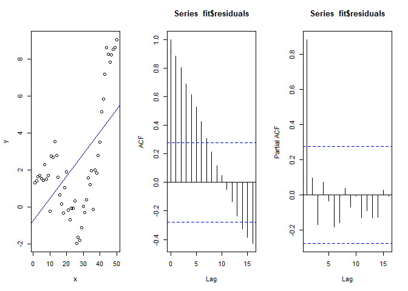

Newey-West HAC errors for OLS
================
Nayef Ahmad
2022-03-08

-   [1 Overview](#overview)
-   [2 Libraries](#libraries)

# 1 Overview

Reference:

-   [Cross Validated - OLS regression with Newey-West error
    term](https://stats.stackexchange.com/a/254596/56828)

# 2 Libraries

``` r
library(lmtest)
```

    ## Warning: package 'lmtest' was built under R version 4.0.5

    ## Loading required package: zoo

    ## Warning: package 'zoo' was built under R version 4.0.3

    ## 
    ## Attaching package: 'zoo'

    ## The following objects are masked from 'package:base':
    ## 
    ##     as.Date, as.Date.numeric

``` r
library(sandwich)
```

    ## Warning: package 'sandwich' was built under R version 4.0.5

``` r
n <- 50
slope <- .05


correlated_residuals <- arima.sim(list(ar = .9), n)
x <- 1:n
y <- slope*(x) + correlated_residuals

fit <- lm(y~x)

par(mfrow = c(1,3))
plot(x,y)
abline(fit, col = 'blue')
acf(fit$residuals)
pacf(fit$residuals)
```

<!-- -->

``` r
summary(fit) # standard estimates
```

    ## 
    ## Call:
    ## lm(formula = y ~ x)
    ## 
    ## Residuals:
    ##     Min      1Q  Median      3Q     Max 
    ## -4.4296 -1.9862 -0.1291  1.9976  4.0549 
    ## 
    ## Coefficients:
    ##             Estimate Std. Error t value Pr(>|t|)    
    ## (Intercept) -0.75128    0.72329  -1.039    0.304    
    ## x            0.12072    0.02469   4.890 1.17e-05 ***
    ## ---
    ## Signif. codes:  0 '***' 0.001 '**' 0.01 '*' 0.05 '.' 0.1 ' ' 1
    ## 
    ## Residual standard error: 2.519 on 48 degrees of freedom
    ## Multiple R-squared:  0.3326, Adjusted R-squared:  0.3187 
    ## F-statistic: 23.92 on 1 and 48 DF,  p-value: 1.169e-05

``` r
coeftest(fit, vcov = NeweyWest(fit, verbose = T))
```

    ## 
    ## Lag truncation parameter chosen: 3

    ## 
    ## t test of coefficients:
    ## 
    ##             Estimate Std. Error t value Pr(>|t|)
    ## (Intercept) -0.75128   13.18212 -0.0570   0.9548
    ## x            0.12072    0.74821  0.1614   0.8725

``` r
n <- 50
slope <- .05


y <- arima.sim(list(ar = .9), n)
x <- 1:n

fit <- lm(y~x)

par(mfrow = c(1,3))
plot(x,y)
abline(fit, col = 'blue')
acf(fit$residuals)
pacf(fit$residuals)
```

<!-- -->

``` r
summary(fit) # standard estimates
```

    ## 
    ## Call:
    ## lm(formula = y ~ x)
    ## 
    ## Residuals:
    ##    Min     1Q Median     3Q    Max 
    ## -3.980 -1.467  0.256  1.362  3.198 
    ## 
    ## Coefficients:
    ##             Estimate Std. Error t value Pr(>|t|)    
    ## (Intercept)  1.87312    0.52641   3.558 0.000853 ***
    ## x           -0.11668    0.01797  -6.495 4.38e-08 ***
    ## ---
    ## Signif. codes:  0 '***' 0.001 '**' 0.01 '*' 0.05 '.' 0.1 ' ' 1
    ## 
    ## Residual standard error: 1.833 on 48 degrees of freedom
    ## Multiple R-squared:  0.4677, Adjusted R-squared:  0.4566 
    ## F-statistic: 42.18 on 1 and 48 DF,  p-value: 4.384e-08

``` r
coeftest(fit, vcov = NeweyWest(fit, verbose = T))
```

    ## 
    ## Lag truncation parameter chosen: 2

    ## 
    ## t test of coefficients:
    ## 
    ##              Estimate Std. Error t value Pr(>|t|)
    ## (Intercept)  1.873119   1.893252  0.9894   0.3274
    ## x           -0.116682   0.072256 -1.6148   0.1129
