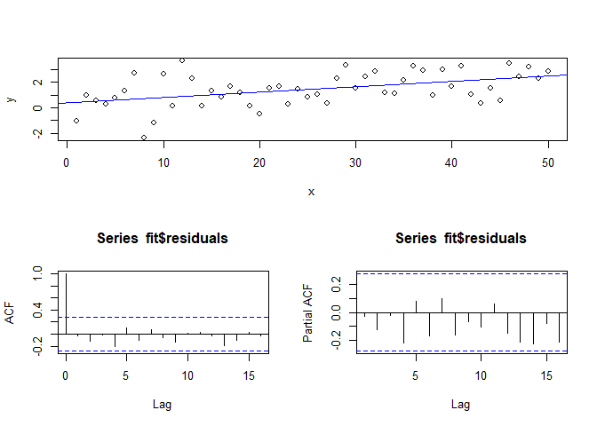
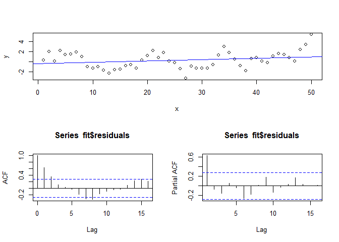

Modeling autocorrelations: Newey-West HAC and ARIMA modeling
================
Nayef Ahmad
2022-03-08

-   [1 Overview](#overview)
-   [2 Libraries](#libraries)
-   [3 Functions](#functions)
-   [4 Example 1: White noise error (base
    case)](#example-1-white-noise-error-base-case)
-   [5 Example 2: Autocorrelated error](#example-2-autocorrelated-error)
-   [6 Example 3: Pure ARIMA series as dependent
    variable](#example-3-pure-arima-series-as-dependent-variable)

# 1 Overview

When there is autocorrelation of residuals, this means that your model
is leaving value on the table - out of sheer laziness, it has not
accounted for all of the structure available. You should not want to
listen to the advice of someone who does not work as hard as you do. Ask
them to work harder and come back to you after they’ve done their
homework. Then you can discuss results (i.e. make inferences).

In this file, we explore two ways to get your model to “work harder” and
account for autocorrelation. The first is to use OLS as usual, then
correct the estimate of the covariance matrix of the parameters. The
second is to directly model autocorrelation using an ARIMA model.

**References:**

-   [Cross Validated - OLS regression with Newey-West error
    term](https://stats.stackexchange.com/a/254596/56828). This includes
    a simulation of autocorrelated residuals, and compares ordinary OLS
    vs HAC inferences.
-   [Cross Validated - two ways of dealing with the problem of
    autocorrelated
    errors](https://stats.stackexchange.com/a/181297/56828). This argues
    that the ARIMA approach is better than using OLS + HAC errors.

# 2 Libraries

``` r
library(lmtest)
```

    ## Warning: package 'lmtest' was built under R version 4.0.5

    ## Loading required package: zoo

    ## Warning: package 'zoo' was built under R version 4.0.3

    ## 
    ## Attaching package: 'zoo'

    ## The following objects are masked from 'package:base':
    ## 
    ##     as.Date, as.Date.numeric

``` r
library(sandwich)
```

    ## Warning: package 'sandwich' was built under R version 4.0.5

``` r
library(forecast)
```

    ## Warning: package 'forecast' was built under R version 4.0.5

    ## Registered S3 method overwritten by 'quantmod':
    ##   method            from
    ##   as.zoo.data.frame zoo

``` r
par(mfrow = c(1,3))

layout.matrix <- matrix(c(1, 2, 1, 3), nrow = 2, ncol = 2)
layout(mat = layout.matrix)
# layout.show(3)
```

# 3 Functions

``` r
get_slope_line_vector_from_arima <- function(arima_model_fitted){
  # Args: 
  # - arima_model_fitted: Fitted ARIMA model, such as the models returned 
  #     by forecast::auto.arima()
  # 
  # Returns: 
  # - line_vector: A numeric vector of same length as the data passed to 
  #     the ARIMA fitting procedure. These values represent the underlying 
  #     linear trend after fitting the ARIMA model 
  
  if (is.na(arima_model_fitted$coef["intercept"])) {
    intercept <- 0
  } else {
    intercept <- arima_model_fitted$coef["intercept"]
  }
  
  if (is.na(arima_model_fitted$coef["xreg"])) {
    slope <- 0
  } else {
    slope <- arima_model_fitted$coef["xreg"]
  }
  
  line_vector <- 
    intercept + slope * c(1:arima_model_fitted$nobs)
  
  return(line_vector)
}
```

# 4 Example 1: White noise error (base case)

First set up the data.

``` r
n <- 50
slope <- .05


white_noise_residuals <- rnorm(n)
x <- 1:n
y <- slope*(x) + white_noise_residuals
```

Fit lm model, and plot.

``` r
layout.matrix <- matrix(c(1, 2, 1, 3), nrow = 2, ncol = 2)
layout(mat = layout.matrix)


fit <- lm(y~x)

plot(x,y)
abline(fit, col = 'blue')
acf(fit$residuals)
pacf(fit$residuals)
```

<!-- -->

Model output, using standard and Newey-West HAC errors:

``` r
summary(fit) # standard estimates
```

    ## 
    ## Call:
    ## lm(formula = y ~ x)
    ## 
    ## Residuals:
    ##      Min       1Q   Median       3Q      Max 
    ## -2.33544 -0.73963  0.06635  0.70760  2.75413 
    ## 
    ## Coefficients:
    ##             Estimate Std. Error t value Pr(>|t|)    
    ## (Intercept) -0.61276    0.29923  -2.048   0.0461 *  
    ## x            0.05600    0.01021   5.483 1.53e-06 ***
    ## ---
    ## Signif. codes:  0 '***' 0.001 '**' 0.01 '*' 0.05 '.' 0.1 ' ' 1
    ## 
    ## Residual standard error: 1.042 on 48 degrees of freedom
    ## Multiple R-squared:  0.3851, Adjusted R-squared:  0.3723 
    ## F-statistic: 30.07 on 1 and 48 DF,  p-value: 1.527e-06

``` r
coeftest(fit, vcov = NeweyWest(fit, verbose = T))
```

    ## 
    ## Lag truncation parameter chosen: 8

    ## 
    ## t test of coefficients:
    ## 
    ##               Estimate Std. Error t value  Pr(>|t|)    
    ## (Intercept) -0.6127589  0.1296910 -4.7248 2.044e-05 ***
    ## x            0.0559995  0.0042046 13.3186 < 2.2e-16 ***
    ## ---
    ## Signif. codes:  0 '***' 0.001 '**' 0.01 '*' 0.05 '.' 0.1 ' ' 1

Fit ARIMA model, and plot

``` r
layout.matrix <- matrix(c(1, 2, 1, 3), nrow = 2, ncol = 2)
layout(mat = layout.matrix)

fit_arima <- auto.arima(y, xreg = x)

plot(x,y)
lines(fit_arima$fitted, col = "blue")
lines(get_slope_line_vector_from_arima(fit_arima), col = "darkgreen")
acf(fit_arima$residuals)
pacf(fit_arima$residuals)
```

<!-- -->

ARIMA model output:

``` r
summary(fit_arima)
```

    ## Series: y 
    ## Regression with ARIMA(0,0,0) errors 
    ## 
    ## Coefficients:
    ##       intercept   xreg
    ##         -0.6128  0.056
    ## s.e.     0.2932  0.010
    ## 
    ## sigma^2 = 1.086:  log likelihood = -71.99
    ## AIC=149.98   AICc=150.5   BIC=155.71
    ## 
    ## Training set error measures:
    ##                        ME     RMSE       MAE      MPE    MAPE      MASE
    ## Training set 5.224156e-14 1.021065 0.8298999 91.17292 124.853 0.6877414
    ##                     ACF1
    ## Training set -0.09153191

# 5 Example 2: Autocorrelated error

In cases where non-arima fit gives almost same estimate as arima fit,
but p-value of t-test for coefficient is far from significant, I would
prefer the arima fit.

-   Examples where Arima fit is better than OLS:
    -   seed 1, 2, 4, 5, 10, 13, 16, 17, 20
-   Examples where Arima fit is better than OLS + HAC:
    -   seed 1, 2, 4, 5, 10, 12, 13, 14, 15, 16, 17, 19, 20
-   Examples where no benefit to Arima:
    -   seed 3, 6, 7, 8, 9, 11, 18

First set up the data.

``` r
seed <- 2
set.seed(seed)

n <- 50
slope <- .05


correlated_residuals <- arima.sim(list(ar = .9), n)
x <- 1:n
y <- slope*(x) + correlated_residuals
```

Fit lm model, and plot.

``` r
layout.matrix <- matrix(c(1, 2, 1, 3), nrow = 2, ncol = 2)
layout(mat = layout.matrix)

fit <- lm(y~x)

plot(x,y)
abline(fit, col = 'blue')
acf(fit$residuals)
pacf(fit$residuals)
```

<!-- -->

Model output, using standard and Newey-West HAC errors:

``` r
summary(fit) # standard estimates
```

    ## 
    ## Call:
    ## lm(formula = y ~ x)
    ## 
    ## Residuals:
    ##     Min      1Q  Median      3Q     Max 
    ## -3.6238 -1.2741 -0.1119  1.1357  4.3991 
    ## 
    ## Coefficients:
    ##             Estimate Std. Error t value Pr(>|t|)  
    ## (Intercept) -0.46224    0.46547  -0.993   0.3257  
    ## x            0.02811    0.01589   1.769   0.0832 .
    ## ---
    ## Signif. codes:  0 '***' 0.001 '**' 0.01 '*' 0.05 '.' 0.1 ' ' 1
    ## 
    ## Residual standard error: 1.621 on 48 degrees of freedom
    ## Multiple R-squared:  0.06123,    Adjusted R-squared:  0.04168 
    ## F-statistic: 3.131 on 1 and 48 DF,  p-value: 0.08317

``` r
coeftest(fit, vcov = NeweyWest(fit, verbose = T))
```

    ## 
    ## Lag truncation parameter chosen: 1

    ## 
    ## t test of coefficients:
    ## 
    ##             Estimate Std. Error t value Pr(>|t|)
    ## (Intercept) -0.46224    4.57966 -0.1009   0.9200
    ## x            0.02811    0.23621  0.1190   0.9058

Fit ARIMA model, and plot

``` r
layout.matrix <- matrix(c(1, 2, 1, 3), nrow = 2, ncol = 2)
layout(mat = layout.matrix)

fit_arima <- auto.arima(y, xreg = x)
summary(fit_arima)
```

    ## Series: y 
    ## Regression with ARIMA(1,0,0) errors 
    ## 
    ## Coefficients:
    ##          ar1    xreg
    ##       0.7457  0.0287
    ## s.e.  0.1060  0.0213
    ## 
    ## sigma^2 = 1.381:  log likelihood = -78.39
    ## AIC=162.79   AICc=163.31   BIC=168.52
    ## 
    ## Training set error measures:
    ##                       ME     RMSE       MAE       MPE    MAPE      MASE
    ## Training set -0.06508041 1.151214 0.9707687 -66.25045 195.649 0.9561247
    ##                    ACF1
    ## Training set 0.05940882

``` r
plot(x,y)
lines(fit_arima$fitted, col = "blue")
lines(get_slope_line_vector_from_arima(fit_arima), col = "darkgreen")
acf(fit_arima$residuals)
pacf(fit_arima$residuals)
```

<!-- -->

In this specific example, where `seed =` 2, we can see that the OLS fit
and the (OLS + HAC) fit find the estimate a slope value close to the
true value of 0.05, but because of the large amount of unexplained
structure, inference is not valid - the slope coefficient is not
significant.

On the other hand, the ARIMA fit includes the slope, and the estimate is
relatively close to the true value.

# 6 Example 3: Pure ARIMA series as dependent variable

First set up the data.

``` r
seed <- 3
set.seed(seed)

n <- 50
slope <- .05


y <- arima.sim(list(ar = .9), n)
x <- 1:n
```

Fit lm model, and plot.

``` r
layout.matrix <- matrix(c(1, 2, 1, 3), nrow = 2, ncol = 2)
layout(mat = layout.matrix)

fit <- lm(y~x)

plot(x,y)
abline(fit, col = 'blue')
acf(fit$residuals)
pacf(fit$residuals)
```

<!-- -->

Model output, using standard and Newey-West HAC errors:

``` r
summary(fit) # standard estimates
```

    ## 
    ## Call:
    ## lm(formula = y ~ x)
    ## 
    ## Residuals:
    ##      Min       1Q   Median       3Q      Max 
    ## -2.63213 -0.99396 -0.05379  1.15511  3.00291 
    ## 
    ## Coefficients:
    ##             Estimate Std. Error t value Pr(>|t|)
    ## (Intercept)  0.71744    0.43512   1.649    0.106
    ## x            0.02203    0.01485   1.483    0.144
    ## 
    ## Residual standard error: 1.515 on 48 degrees of freedom
    ## Multiple R-squared:  0.04384,    Adjusted R-squared:  0.02392 
    ## F-statistic: 2.201 on 1 and 48 DF,  p-value: 0.1445

``` r
coeftest(fit, vcov = NeweyWest(fit, verbose = T))
```

    ## 
    ## Lag truncation parameter chosen: 2

    ## 
    ## t test of coefficients:
    ## 
    ##             Estimate Std. Error t value Pr(>|t|)
    ## (Intercept) 0.717443   0.712958  1.0063   0.3193
    ## x           0.022030   0.033051  0.6665   0.5083

Fit ARIMA model, and plot

``` r
layout.matrix <- matrix(c(1, 2, 1, 3), nrow = 2, ncol = 2)
layout(mat = layout.matrix)

fit_arima <- auto.arima(y, xreg = x)
summary(fit_arima)
```

    ## Series: y 
    ## Regression with ARIMA(1,0,0) errors 
    ## 
    ## Coefficients:
    ##          ar1    xreg
    ##       0.8578  0.0363
    ## s.e.  0.0680  0.0223
    ## 
    ## sigma^2 = 0.6203:  log likelihood = -58.65
    ## AIC=123.31   AICc=123.83   BIC=129.05
    ## 
    ## Training set error measures:
    ##                      ME      RMSE       MAE      MPE     MAPE      MASE
    ## Training set 0.04447121 0.7717022 0.6491208 150.3636 298.8786 0.9782997
    ##                   ACF1
    ## Training set 0.0796193

``` r
plot(x,y)
lines(fit_arima$fitted, col = "blue")
lines(get_slope_line_vector_from_arima(fit_arima), col = "darkgreen")
acf(fit_arima$residuals)
pacf(fit_arima$residuals)
```

<!-- -->
