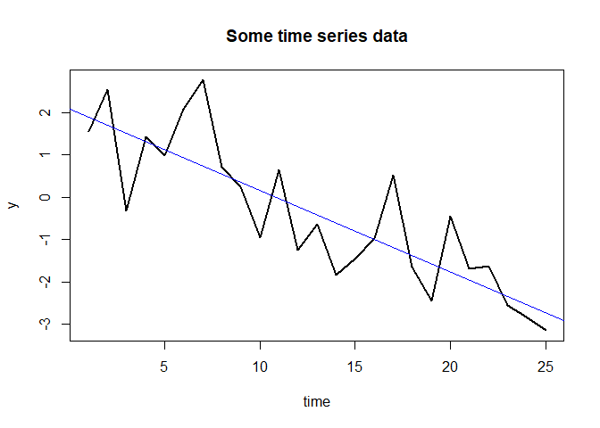
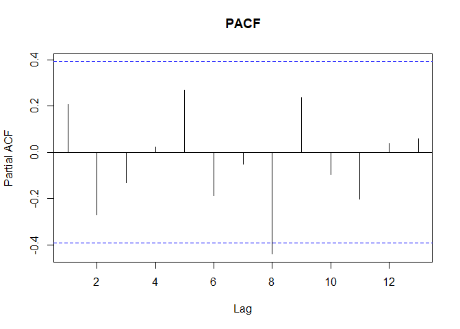

Trend-stationary vs difference-stationary time series
================
Nayef Ahmad
2022-07-18

-   [1 Overview](#overview)
    -   [1.1 References](#references)
-   [2 Libraries](#libraries)
-   [3 Example](#example)
    -   [3.1 Note on those blue lines in the ACF and
        PACF](#note-on-those-blue-lines-in-the-acf-and-pacf)
    -   [3.2 Recreating Table 1 from Nelson &
        Kang (1984)](#recreating-table-1-from-nelson-kang-1984)

# 1 Overview

Someone gives you data that looks like this, and asks, “I know the OLS
line has +ve slope, but is that a *real* trend, or is it just a fluke?”
What do you do?

\[image\]

First, give kudos for acknowledging a fundamental statistical idea: the
difference between systematic vs “random” effects (purely due to
sampling variability). They are right to hesitate before
over-interpreting the OLS line.

Next, remember that substantive questions have to be translated into
statistical models, and there can be more than one way of doing so. Your
client is strongly hinting that you should interpret the slope
coefficient in this model:

\[image\]

However, this is not the only model that can account for this data. At
least one other model is worth considering:

\[image\]

This model says that there is no systematic trend. Instead, there is a
systematic *dependence structure* across values of the series.

What if both these models (the trend + white noise and the AR model)
seem to account for the data pretty well? Then we should keep an open
mind and not be too confident in either one of them.

Here’s an analogy: In optimization theory, there are three classes of
problems: 1) one unique solution 2) no solutions 3) infinite solutions

This is somewhat analogous to statistical models: the model you
specified could be the unique correct model (great!). Or it might be
completely inappropriate; or it might be one of many other possible
models that could account for the data. In the latter two cases, don’t
take your model’s estimates too seriously.

## 1.1 References

1.  Nelson & Kang, *Pitfalls in the use of time as an explanatory
    variable in regression*, 1984.

2.  Durlauf & Phillips, *Trends versus random walks in time series
    analysis*, 1988.

3.  Nelson & Plosser, *Trends and random walks in macroeconomic time
    series*, 1982

# 2 Libraries

``` r
library(forecast)
```

    ## Warning: package 'forecast' was built under R version 4.0.5

    ## Registered S3 method overwritten by 'quantmod':
    ##   method            from
    ##   as.zoo.data.frame zoo

``` r
layout.matrix <- matrix(c(1, 2, 1, 3), nrow = 2, ncol = 2)
layout(mat = layout.matrix)

# if (dev.cur() > 1) {dev.off()}  # used to turn off layout settings 
```

# 3 Example

``` r
set.seed(2021)

series_length <- 25
ar_coefficient <- .6

y <- arima.sim(series_length, 
               model = list(ar = ar_coefficient))
time <- 1:series_length
plot(time, y, type = "l", lwd = 2, main = "Some time series data")

fit <- lm(y~time)
abline(fit, col = "blue")
```

<!-- -->

``` r
acf(y, main = "ACF")
```

<!-- -->

``` r
pacf(y, main = "PACF")
```

<!-- -->

## 3.1 Note on those blue lines in the ACF and PACF

Focus on the ACF plot here.

``` r
set.seed(2021)

series_length <- 25
ma_coefficient <- .6

y <- arima.sim(series_length, 
               model = list(ma = ma_coefficient))
time <- 1:series_length
plot(time, y, type = "l", lwd = 2, main = "Some time series data")

fit <- lm(y~time)
abline(fit, col = "blue")
```

<!-- -->

``` r
acf(y, main = "ACF")
```

<!-- -->

``` r
pacf(y, main = "PACF")
```

<!-- -->

## 3.2 Recreating Table 1 from Nelson & Kang (1984)

> As a result, the true null hypotheses ,B =a and a = 0 are rejected
> with frequencies of 87% and 80%, respectively, at a nominal 5%
> significance level.
